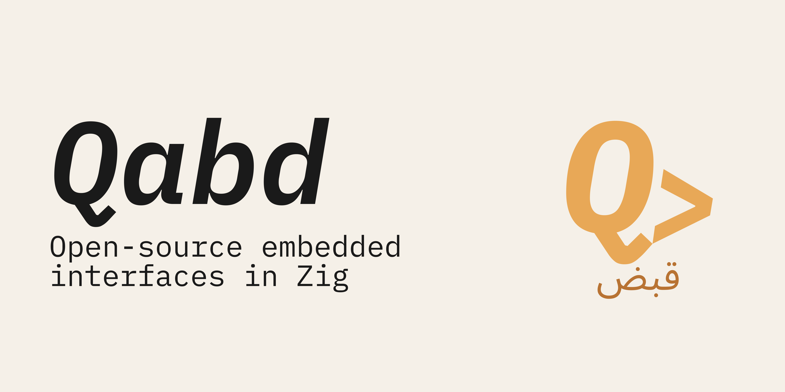

<a href="https://t.me/qabd_lab">
	<picture>
		<source media="(prefers-color-scheme: dark)" srcset="brand/BannerLight.png">
		
	</picture>
</a>

 

 

## What is qabd?

qabd is an open-source organization building low-level tools for human-computer interaction through biosignals and gesture recognition — firmware, signal processing pipelines, and hardware designs, all written in Zig.

The name comes from Arabic **قبض** (*qabd*) — *to grasp, to hold, to seize*. We think the gap between a human intention and a machine response should be as thin as possible. That's what we build toward.

## Why Zig?

There are currently no Zig libraries for biosignal processing. We intend to change that.

Zig gives us explicit allocators for predictable real-time behavior, `comptime` for zero-cost channel configuration, and clean cross-compilation to ESP32-S3 targets. No hidden control flow, no runtime surprises, no GC pauses in the middle of a signal buffer.

## Contributing

The project is in early development. Hardware designs and firmware will be fully open once the first prototype is stable. If you're interested in Zig, embedded systems, or biosignal processing — open an issue or start a discussion.

[Contributing](./CONTRIBUTING.md)

## License

[MIT](LICENSE)
